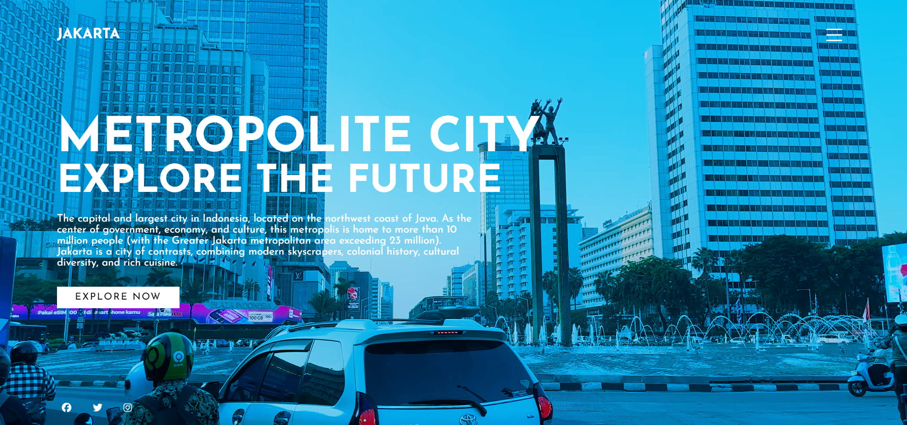

# City Landing Page

A modern, responsive landing page showcasing a metropolitan city theme.  

Built using HTML, CSS, and JavaScript, this project demonstrates a stylish hero section with video background, animated navigation menu, and clean typography.

---
## Demo

https://jakata-city-video-landing-page.vercel.app

---

## 📸 Preview

---

## ✨ Features

- Fullscreen autoplay background video

- Animated menu toggle sidebar

- Overlay color blend effect

- Responsive typography

- Social media icon links

- Minimalist UI design

---

## 📁 Project Structure

project-folder/

│

├── index.html

├── assets/

│ ├── css/

│ │ └── style.css

│ ├── js/

│ │ └── main.js

│ └── img/

│ ├── video.mp4

│ ├── menu.png

│ └── close.png

---

## 🚀 How to Run

1. Download or clone repository

2. Open folder

3. Run `index.html` in browser

---

## 🛠️ Built With

- HTML5

- CSS3

- Vanilla JavaScript

- Font Awesome Icons

- Google Fonts

---

\## 📱 Responsive Design

Layout adapts automatically for smaller screens using CSS media queries.

---

## 📄 License

This project is licensed under the MIT License — see the LICENSE file for details.

---

## 👨‍💻 Author

Sultan Achmad

Created as a front-end practice and UI showcase project.

